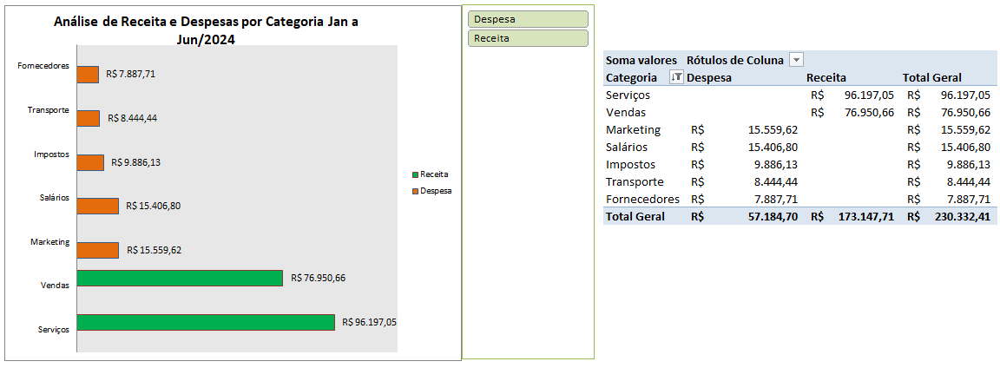
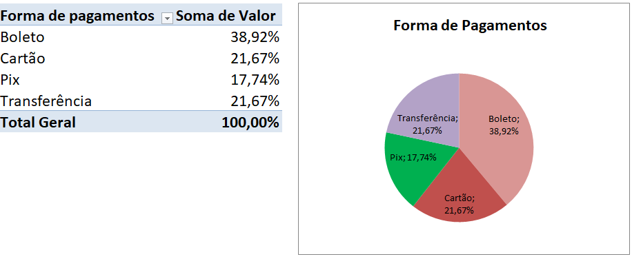
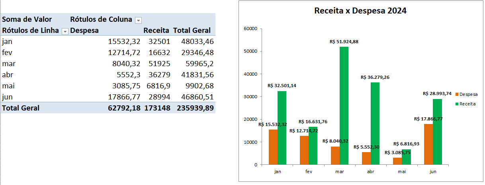

# 📊 Análise de Base de Dados Financeira

Projeto de análise de dados financeiros desenvolvido com Microsoft Excel.  
A base contém registros de receitas e despesas de uma empresa ao longo do ano de 2024.

---

## 📁 Estrutura do repositório

```
analise-financeira-excel/
├── README.md
├── dados/
│   └── base_dados_financeira.xlsx       ← base original (não editada)
├── analise/
│   └── analise_financeira.xlsx          ← arquivo com análises e dashboards
└── prints/
    ├── tabela-dinamica-categorias.png
    ├── grafico-receita-despesa.png
    └── dashboard-final.png
```

---

## 📋 Sobre os dados

| Campo | Descrição |
|---|---|
| Data | Data da transação (jan–jun 2024) |
| Categoria | Tipo da transação (Vendas, Serviços, Salários, Marketing, etc.) |
| Descrição | Detalhe da transação |
| Tipo | Receita ou Despesa |
| Valor | Valor em reais (R$) |
| Forma de Pagamento | Cartão, Pix, Boleto ou Transferência |

- **Total de registros:** ~100 transações
- **Período:** Janeiro a Junho de 2024
- **Categorias de receita:** Vendas, Serviços
- **Categorias de despesa:** Salários, Marketing, Impostos, Aluguel, Transporte, Fornecedores

---

## 🔍 Análises realizadas

### 1. Limpeza e organização dos dados
- Formatação da coluna de datas
- Aplicação de filtros para navegação rápida
- Formatação condicional para destacar Receitas (verde) e Despesas (vermelho)

### 2. Resumo financeiro geral
- Total de receitas no período
- Total de despesas no período
- Resultado líquido (Receita − Despesa)
- Funções utilizadas: `SOMASE`, `CONT.SE`, `SOMA`

### 3. Análise por categoria
- Quanto cada categoria representa no total de despesas
- Quais categorias geram mais receita
- Ferramenta utilizada: Tabela Dinâmica
- 

### 4. Análise por forma de pagamento
- Distribuição das transações por Cartão, Pix, Boleto e Transferência
- Ferramenta utilizada: Tabela Dinâmica + Gráfico de Pizza
- 


### 5. Evolução mensal
- Receitas e despesas mês a mês (jan–jun 2024)
- Identificação dos meses com melhor e pior resultado
- Ferramenta utilizada: Tabela Dinâmica + Gráfico de Linhas
- 

---

## 🛠 Funções e recursos utilizados

| Recurso | Aplicação |
|---|---|
| `SOMASE` | Somar receitas e despesas separadamente |
| `CONT.SE` | Contar transações por tipo ou categoria |
| `MÉDIA` | Ticket médio por categoria |
| `MÁXIMO` / `MÍNIMO` | Maior e menor transação |
| Tabela Dinâmica | Resumo por categoria, mês e forma de pagamento |
| Formatação Condicional | Destacar receitas e despesas visualmente |
| Gráficos | Barras, linhas e pizza para visualização |
| Filtros | Navegação e segmentação dos dados |

---

## 💡 Principais aprendizados

- Como organizar uma base de dados financeira no Excel
- Uso de `SOMASE` para separar receitas e despesas automaticamente
- Criação de Tabela Dinâmica para resumir grandes volumes de dados
- Construção de gráficos para comunicar resultados de forma visual

---

## 👩‍💻 Sobre

Projeto desenvolvido durante meu processo de transição de carreira para a área de dados.  
Faz parte do repositório [estudos-excel](../estudos-excel).

[](https://linkedin.com/in/seu-usuario)
[](https://github.com/AlineSilvaDeSouza)

---

> 📌 *Projeto em desenvolvimento — análises sendo incrementadas conforme avanço nos estudos.*
